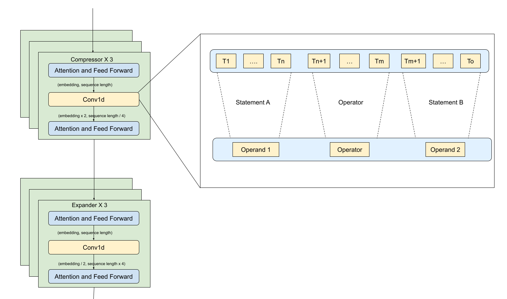
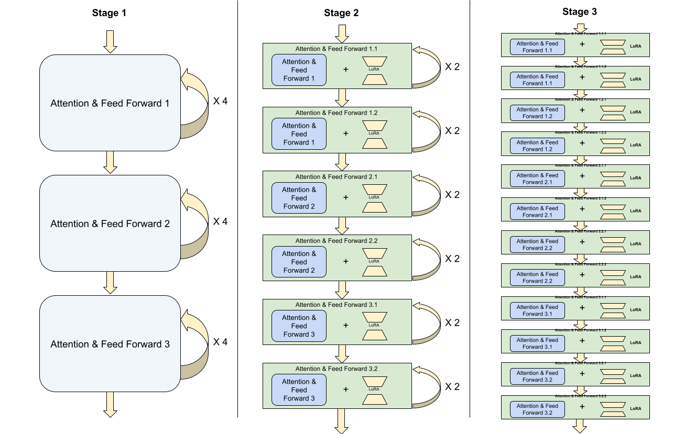
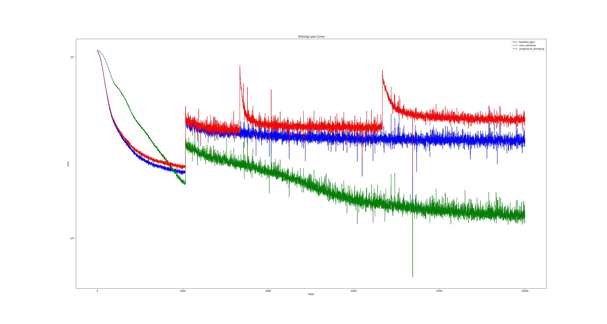

# Introduction
This repository contains variation of language models based on my recent learning of large language model ([notes](https://swortal.blogspot.com/2024/07/ai-reading-notes-deep-learning-and.html)) plus my own ideas. 

It contains following models
-  a baseline gpt2 model for comparison. The baseline model is implemented based on this great tutorial: [build-nanogpt](https://github.com/karpathy/build-nanogpt).  
- A transformer based model with some MLP network being replaced by convolution network so that multiple tokens' embedding are merged into one embedding and attention can be more easily applied on a longer sequence. See [Convolution Attention Model](#convolution-attention-model)
- A transformer based model with multiple layers sharing same weights at the beginning and diverging as training going on. See [Progressive Diverging model](#progressive-diverging-model)

# Disclaimer
My main goal here is to practice building machine learning model with my novel ideas in short term. It is NOT for serious research purpose. Nor are the models well trained since modern language model training requires large amount of time and computation resource which isn't affordable for a personal side project.  And given the models are too large, their hyper parameters won't be tuned and compared using validation dataset. The models are only trained on training dataset once and tested on test dataset.  

# Dataset 
Currently this project mainly focuses on ideas which could improve reasoning capability. Therefore, I use math and reasoning data for training and testing.
- https://huggingface.co/datasets/ajibawa-2023/Maths-College  

- https://huggingface.co/datasets/open-web-math/open-web-math

# Contribution
- 2 variations of transformer based language model with novel ideas
    - [Convolution Attention Model](#convolution-attention-model)
    - [Progressive Diverging model](#progressive-diverging-model)
- Refactored [nanogpt](https://github.com/karpathy/build-nanogpt) code into following reusable components  
    - A [base trainer](base_trainer.py) contains common model training and testing logic which can also be extended for custom training algorithm in the future
    - [AutoRegressiveModel](auto_regressive_model.py) A base model class contains common auto regressive model functions like inference logic
    - [components](components.py) contains basic model components like attention layer, MLP layer etc
    - [BaseDataPreparer](base_data_preparer.py) Data utils to download, tokenize and persist a given dataset from Huggingface.
    - [DataLoader](dataloader.py) Load batches from token data for training and testing
    - [data file utils](data_file_utils.py) Utils to process token files for both data preparer and data loader.
    - [common utils](common_utils.py) contains logger setup, commandline argument parser etc
    - [plot loss](plot_loss.py) Function to plot all model's training loss curve into one chart for comparison

# Custom Models
## Convolution Attention Model
**Model Architecture**
Most math and reasoning problems can be converted to logical inference like 

> **Statement A (Operand)** *AND/OR/+/- (Operator)* **Statement B (Operand)** -> **Statement C** 

where Statement A, B and C can be text of any length.  
To simulate this structure, we can design a model which contains convolution network to transform long sequence of tokens into fewer tokens while with larger embedding for each token. Each operand, operator and result is represented by a single token in the model's inner layers. And attention mechanism is applied to the shorter token sequence to detect relationship among operands and operators.  

- The whole model has 3 compressor blocks and 3 expander blocks like a encoder decoder model. 
- The first 3 blocks are compressor blocks. They compress a sequence with high token number and low embedding size into a sequence with low token number and high embedding size.
- The next 3 blocks are expander blocks. They work reversely by expanding sequence with low token number and large embedding size into a sequence with high token number and low embedding size. 
- Each compressor/expander block has a convolution network in the middle and one attention and feed forward block before and one after the convolution network. 
- Since this model should predict a whole **operand/result**, its loss is calculated by comparing with the sequence 64 (SEQUENCE_FAN_IN_FACTOR ^ 3) tokens ahead instead of 1 token head. 
- 

<b>Detailed model components</b>

    - Input 
    - Vocabulary to embedding 
    - Attention and FeedForward layer 
    - (embedding = initial_n_embedding, sequence length = initial_block_size) 
    - Compressor layer 
    - (embedding = initial_n_embedding * 2, sequence length = initial_block_size / 4) 
    - Attention and FeedForward layer X 2 
    - (embedding = initial_n_embedding * 2, sequence length = initial_block_size / 4) 
    - Compressor layer 
    - (embedding = initial_n_embedding * 4, sequence length = initial_block_size / 16) 
    - Attention and FeedForward layer X 2 
    - (embedding = initial_n_embedding * 4, sequence length = initial_block_size / 16) 
    - Compressor layer 
    - (embedding = initial_n_embedding * 8, sequence length = initial_block_size / 64) 
    - Attention and FeedForward layer X 2  
    - (embedding = initial_n_embedding * 8, sequence length = initial_block_size / 64) 
    - Expander layer 
    - (embedding = initial_n_embedding * 4, sequence length = initial_block_size / 16) 
    - Attention and FeedForward layer X 2 
    - (embedding = initial_n_embedding * 4, sequence length = initial_block_size / 16) 
    - Expander layer 
    - (embedding = initial_n_embedding * 2, sequence length = initial_block_size / 4) 
    - Attention and FeedForward layer X 2 
    - (embedding = initial_n_embedding * 2, sequence length = initial_block_size / 4) 
    - Expander layer 
    - (embedding = initial_n_embedding, sequence length = initial_block_size) 
    - Attention and FeedForward layer  
    - (embedding = initial_n_embedding, sequence length = initial_block_size) 
    - Embedding to vocabulary 

 

 

<b>Related Works</b>

**sentence embedding** 

[https://airbyte.com/data-engineering-resources/sentence-word-embeddings#:~:text=Sentence and word embeddings are,process and analyze text accurately](https://airbyte.com/data-engineering-resources/sentence-word-embeddings#:~:text=Sentence%20and%20word%20embeddings%20are,process%20and%20analyze%20text%20accurately). 

You can generate these embeddings using the Universal Sentence Encoder (USE), Smooth Inference Frequency (SIF), InferSent, and BERT.

**bert generates sentence embedding** 

https://datascience.stackexchange.com/questions/62658/how-to-get-sentence-embedding-using-bert

either pool all output embedding, or use [cls]’s embedding

**sentence transformer lib** 

https://www.sbert.net/docs/quickstart.html#sentence-transformer 

https://www.sbert.net/ 

**universal sentence encoder**

https://static.googleusercontent.com/media/research.google.com/en//pubs/archive/46808.pdf 

**An Exploration of Hierarchical Attention Transformers
for Efficient Long Document Classification**

https://arxiv.org/pdf/2210.05529

 

## Progressive Diverging model
**Model Architecture**  
This [talk](https://youtu.be/yBL7J0kgldU?si=koiBhKpq3Cp1M8G7) mentions that *More layers improve reasoning skill especially high depth reasoning with many steps*. But more layers would also cause gradient deterioration problem. [EfficientML](https://www.youtube.com/watch?v=rCFvPEQTxKI&list=PL80kAHvQbh-pT4lCkDT53zT8DKmhE0idB) mentions that in the late training stage, the parameters of the layers which are closer to input change much less frequently than the one closer to output. This indicates that some parameters stabilize in early stage while others are flexible till the end of training. 

Based on above findings, I propose following training strategy whose goal is to improve performance on more layers for longer reasoning chain while overcome gradient deterioration problem. 
- The training process is divided into three stages:
- Each stage is trained on 1/3 of the training data
- In each stage, the components' parameters are progressively diverged.
- This model is similar to GPT2 model with 12 layers of Attention and FeedForward blocks.
- The core idea is to train fewer parameters in the beginning and then diverge the parameters as training goes on.
- At Stage 1, the 12 layers are divided into 3 groups, each group has 4 layers.
    - Each group shares same Attention and FeedForward block and hench shares same parameters while the block is called 4 times in serial.
    - And the block's parameters' gradients are updated four times in a backward pass.
- At Stage 2, the 12 layers are again divided into 6 groups, each group has 2 layers.
    - Each group shares same Attention and FeedForward block whose initial parameters are duplicated from corresponding Stage 1's block.
    - Each block's attention parameters are updated using LORA technique and the feedforward parameters are updated as usual.
    - And the block's parameters' gradients are updated 2 times in a backward pass.
- At Stage 3, each of 12 layers has its own Attention and FeedForward block.
    - Each block's parameters duplicated from corresponding Stage 2's block.
    - And attention parameters are updated using LORA technique and the feedforward parameters are updated as usual.

 

 

<b>Related Works</b>

**1. Progressive Neural Networks:**

Progressive Neural Networks introduce new layers or columns alongside existing ones to facilitate transfer learning across different tasks. These networks expand by adding new layers with lateral connections to previously learned features, enabling the integration of new information without catastrophic forgetting.

[arXiv](https://arxiv.org/abs/1606.04671?utm_source=chatgpt.com)

**2. AutoGrow: Automatic Layer Growing in Deep Convolutional Networks:**

AutoGrow is a method that automates the process of determining the optimal depth of deep neural networks. Starting from a shallow architecture, it progressively adds new layers if such growth leads to improved accuracy. The process continues until adding more layers no longer yields performance gains.

[arXiv](https://arxiv.org/abs/1906.02909?utm_source=chatgpt.com)

**3. Gradual DropIn of Layers to Train Very Deep Neural Networks:**

This technique involves starting with a shallow network and gradually adding new layers during training. The newly added layers are initially bypassed, and their influence is incrementally increased. This method helps in training very deep networks by mitigating issues related to gradient vanishing or explosion.

[arXiv](https://arxiv.org/abs/1511.06951?utm_source=chatgpt.com)

**4. When To Grow? A Fitting Risk-Aware Policy for Layer Growing in Deep Neural Networks:**

This study investigates the optimal timing for adding new layers to a neural network during training. It reveals that neural growth inherently exhibits a regularization effect, and the timing of growth can significantly influence model performance.

[arXiv](https://arxiv.org/abs/2401.03104?utm_source=chatgpt.com)

**MixtureGrowth: Growing Neural Networks by Recombining Learned Parameters:**

MixtureGrowth explores growing neural networks by recombining learned parameters. It analyzes the sensitivity to growth points and the characteristics of learned features, providing insights into effective strategies for network expansion.

[Open Access CVF](https://openaccess.thecvf.com/content/WACV2024/papers/Pham_MixtureGrowth_Growing_Neural_Networks_by_Recombining_Learned_Parameters_WACV_2024_paper.pdf?utm_source=chatgpt.com)

 

# Correctness Check Conducted
- Check if loss drops as training going on.
- Sample model architecture during training process to check if the model is correct.
- Interrupt the training process in the middle and test if checkpoint can be saved and loaded correctly.
- Print data's shape in each model component and check if they are expected.
- Test generating text to sense any bug in the log.
- Print loss and training time for each step.

# Result
Each model is trained on Nvidia RTX 3080 for 80k batches which take around 12 hours. To mitigate the out of memory issue encountered during training, I reduced micro batch size, sequence length and embedding size. But I keep these parameters consistent across the 3 models.  

**Note**: Convolution Attention model has a larger context window because the window will be compressed down to 16 in the middle layers.

| Model | # heads | embedding size | micro batch size | context window | Training Batches | Training Time per batch | Final Training Loss | Testing Batches | Inference time | Average test loss |
| --- | --- | --- | --- | --- | --- | --- | --- | --- | --- | --- |  
| Baseline GPT2 | 6 | 192 | 8 | 256 | 80k | 487ms | 3.54 | 25k | 5.2ms | 3.5 |
| Convolution Attention | 6 | 48 - 496 | 8 | 1024 | 80k | 250ms | 1.42 | 25k | 12.23ms | 1.3 |
| Progressive Diverging | 6 | 192 | 8 | 256 | 80k | 655ms | 4.65 | 25k | 5ms | 4.7 | 

**Training Loss Curve**

# Analysis
- The sudden loss bump for all the 3 models at the early stage is probably caused by training data format change because 2 training datasets are used as mentioned in earlier section. 
- Progressive Diverging model has 2 additional bumps because of stage switch. 
- Progressive Diverging model's training time is little longer than baseline GPT2 model probably because of inefficient implementation of LoRA. 
- Convolution Attention has lower loss maybe because it has larger context window. 

# Limitation And Future Consideration 
- Currently Convolution Attention model's input must be fixed length. If the input is not long enough, I have to pad the input with spaces. In the future, we can design better algorithm to make Convolution Attention model's context window more flexible. 
- Better optimize progressive diverging model's stage 2 and stage 3 models to make their LoRA based training more performant than stage 1 GPT like model.  
- Evaluating a novel model architecture's performance is difficult given high training cost. New strategies can be explored to evaluate a new model more efficiently in early research stage to avoid resource waste

# Reference
- https://github.com/karpathy/build-nanogpt 
- https://github.com/karpathy/nanoGPT 